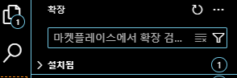
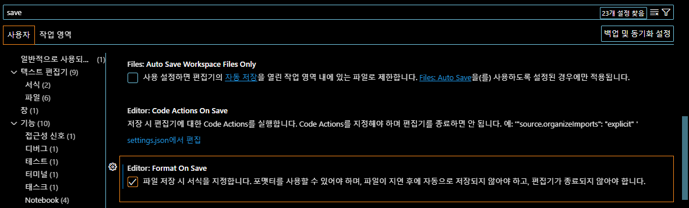

# VS Code 설치

- 검색창에 `vsCode` 를 입력하여 `visual Code Studio`를 찾아 다운로드 및 설치하기

## vsCode 실행하기

- 작업폴더에서 마우스 우클릭하여 vsCode 실행하기

## vsCode 플러그인 설치하기

- 검색 창에 `korea` 입력 :`Korea Lan. Pack` 설치
  

- ctrl + shift + ` : 터미널 열기 -> 기본을 bash로 변경

- 검색창에 `prettier` 입력 : `Prettier - Code formatter` 설치
  

- 검색창에 `EsLint` 입력 : `EsLint` 설치 (js 문법검사)
  

- 검색창에 `ICon` 입력 : `Material Icon Theme` 설치
  

- 검색창에 `live` 입력 : `Live Server` 설치
  

## vsCode 세팅하기

- `Ctrl + ,` 를 눌러 세팅 실행하기
- Editor, Font Famaily : D2Coding 으로 변경하기

- Editor: Format On Save Mode : file로 되어있는지 확인

- formatter 검색하여 Editor: Default Formatter 를 다운로드 받은 Prettier 로 설정
  

- save 검색하여 : Editor: Format On Save 를 체크하기
  
